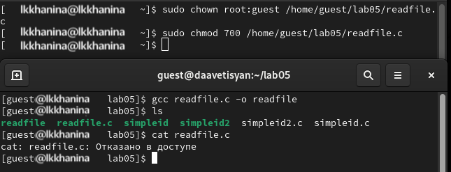

---
## Front matter
lang: ru-RU
title: Презентация лабораторной работы №5
author:
  - Ханина Людмила Константиновна

## i18n babel
babel-lang: russian
babel-otherlangs: english

## Formatting pdf
toc: false
toc-title: Содержание
slide_level: 2
aspectratio: 169
section-titles: true
theme: metropolis
header-includes:
 - \metroset{progressbar=frametitle,sectionpage=progressbar,numbering=fraction}
---

# Презентация к лабораторной работе №5

## Цели и задачи

Изучение механизмов изменения идентификаторов, применения SetUID- и Sticky-битов. Получение практических навыков работы в кон- соли с дополнительными атрибутами. Рассмотрение работы механизма смены идентификатора процессов пользователей, а также влияние бита Sticky на запись и удаление файлов.

## Создание программы

## Устанавливаем компилятор gcc и отключаем систему запретов до очерендной перезагрузки системы:
{#fig:001 width=70%}

## Проверяем успешное выполнение следующих команд:
{#fig:001 width=70%}

## Входим в систему под guest, создаем программу simpleid.c и открываем ее в редакторе:
{#fig:001 width=70%}

## Код программы ниже:
{#fig:001 width=70%}

## Скомпилируем программу и проверим id:
{#fig:001 width=70%}

## Изменим программу, добавив вывод идентификаторов. Файл назовем simpleid2.c:
{#fig:001 width=70%}

## Скомпилируем и запустим программу:
{#fig:001 width=70%}

## От имени суперпользователя выполняем следующие команды, чтобы сменить пользователя на root и установить SetUID-бит:
{#fig:001 width=70%}

## Запускаем программы simpleid2.c и id. Теперь появились различи в uid:
{#fig:001 width=70%}

## Проделаем то же самое для SetUID-бита:
{#fig:001 width=70%}

## Создаем программу readfile.c:
{#fig:001 width=70%}

## Скомпилируем ее и сменим владельца. Поменяем права так, чтобы только суперпользователь моге прочитать его:
{#fig:001 width=70%}

## Поменяем владельца опять и установим SetUID. Проверим: сможет ли программа readfile прочитать readfile.c? Прочитать удалось:
{#fig:001 width=70%}

## Исследование Sticky-бита

## Убедимся, что атрибут Sticky установлен на директории \tmp. От имени пользователя guest создаем файл file01.txt. Просматриваем атрибуты и меняем права файла:
{#fig:001 width=70%}

## От имени пользователя guest2 пробуем прочитать файл — удалось. Далее пытаемся дозаписать в файл слово test2, проверить содержимое файла и записать слово test3, стерев предыдущий текст. Это удастся только при определенных правах. Удалить файл от имени guest2 не удастся никогда — возникает ошибка:
{#fig:001 width=70%}

## Повышаем права до суперпользователя и снимаем атрибут t с директории \tmp. После чего покидаем режим суперпользователя. Проделываем предыдущие шаги. Теперь удалить файл получается:
{#fig:001 width=70%}

## Повышаем свои права до суперпользователя и возращаем арибут t на директорию \tmp.

## Выводы
В ходе выполнения данной лабораторной работы я приобрела практические навыки работы с механизмами изменения идентификаторов, применение SetUID- и Sticky-битами.

