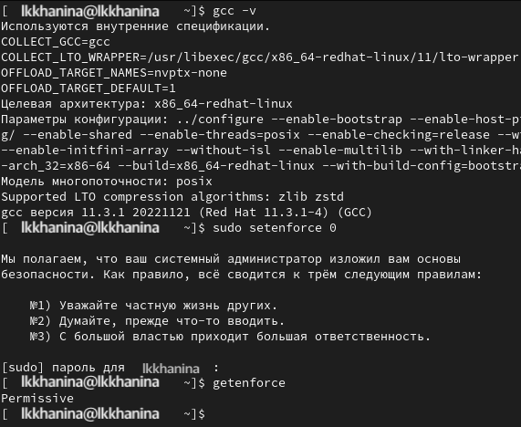
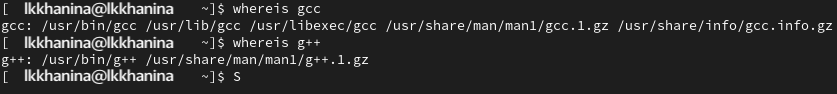
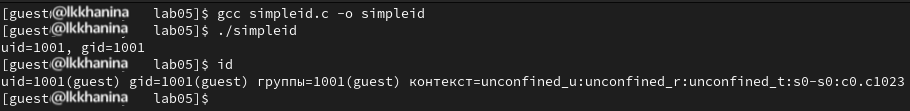
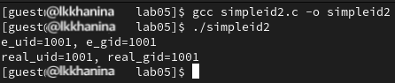
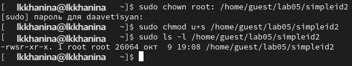
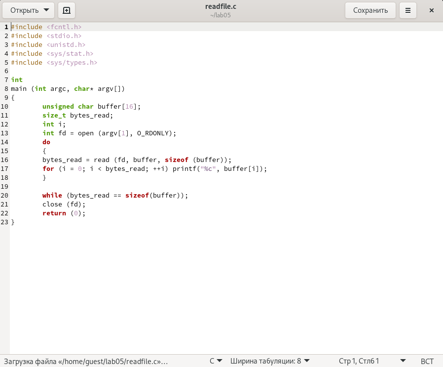

---
## Front matter
title: "Отчёт по лабораторной работе №5"
subtitle: "Дискреционное разграничение прав в Linux. Исследование влияния дополнительных атрибутов"
author: "Ханина Людмила Константиновна"

## Generic otions
lang: ru-RU
toc-title: "Содержание"

## Bibliography
bibliography: bib/cite.bib
csl: pandoc/csl/gost-r-7-0-5-2008-numeric.csl

## Pdf output format
toc: true # Table of contents
toc-depth: 2
lof: true # List of figures
lot: true # List of tables
fontsize: 12pt
linestretch: 1.5
papersize: a4
documentclass: scrreprt
## I18n polyglossia
polyglossia-lang:
  name: russian
  options:
	- spelling=modern
	- babelshorthands=true
polyglossia-otherlangs:
  name: english
## I18n babel
babel-lang: russian
babel-otherlangs: english
## Fonts
mainfont: IBM Plex Serif
romanfont: IBM Plex Serif
sansfont: IBM Plex Sans
monofont: IBM Plex Mono
mathfont: STIX Two Math
mainfontoptions: Ligatures=Common,Ligatures=TeX,Scale=0.94
romanfontoptions: Ligatures=Common,Ligatures=TeX,Scale=0.94
sansfontoptions: Ligatures=Common,Ligatures=TeX,Scale=MatchLowercase,Scale=0.94
monofontoptions: Scale=MatchLowercase,Scale=0.94,FakeStretch=0.9
mathfontoptions:
## Biblatex
biblatex: true
biblio-style: "gost-numeric"
biblatexoptions:
  - parentracker=true
  - backend=biber
  - hyperref=auto
  - language=auto
  - autolang=other*
  - citestyle=gost-numeric
## Pandoc-crossref LaTeX customization
figureTitle: "Рис."
tableTitle: "Таблица"
listingTitle: "Листинг"
lofTitle: "Список иллюстраций"
lotTitle: "Список таблиц"
lolTitle: "Листинги"
## Misc options
indent: true
header-includes:
  - \usepackage{indentfirst}
  - \usepackage{float} # keep figures where there are in the text
  - \floatplacement{figure}{H} # keep figures where there are in the text
---

# Цель работы

Изучение механизмов изменения идентификаторов, применения SetUID- и Sticky-битов. Получение практических навыков работы в кон- соли с дополнительными атрибутами. Рассмотрение работы механизма смены идентификатора процессов пользователей, а также влияние бита Sticky на запись и удаление файлов.

# Выполнение лабораторной работы

## Создание программы

1. Устанавливаем компилятор gcc и отключаем систему запретов до очерендной перезагрузки системы:
{#fig:001 width=70%}

2. Проверяем успешное выполнение следующих команд:
{#fig:001 width=70%}

3. Входим в систему под guest, создаем программу simpleid.c и открываем ее в редакторе:
{#fig:001 width=70%}

4. Код программы ниже:
{#fig:001 width=70%}

5. Скомпилируем программу и проверим id:
{#fig:001 width=70%}

6. Изменим программу, добавив вывод идентификаторов. Файл назовем simpleid2.c:
{#fig:001 width=70%}

7. Скомпилируем и запустим программу:
{#fig:001 width=70%}

8. От имени суперпользователя выполняем следующие команды, чтобы сменить пользователя на root и установить SetUID-бит:
{#fig:001 width=70%}

9. Запускаем программы simpleid2.c и id. Теперь появились различи в uid:
{#fig:001 width=70%}

10. Проделаем то же самое для SetUID-бита:
{#fig:001 width=70%}

11. Создаем программу readfile.c:
{#fig:001 width=70%}

12. Скомпилируем ее и сменим владельца. Поменяем права так, чтобы только суперпользователь моге прочитать его:
{#fig:001 width=70%}

13. Поменяем владельца опять и установим SetUID. Проверим: сможет ли программа readfile прочитать readfile.c? Прочитать удалось:
{#fig:001 width=70%}

## Исследование Sticky-бита

1. Убедимся, что атрибут Sticky установлен на директории \tmp. От имени пользователя guest создаем файл file01.txt. Просматриваем атрибуты и меняем права файла:
{#fig:001 width=70%}

2. От имени пользователя guest2 пробуем прочитать файл — удалось. Далее пытаемся дозаписать в файл слово test2, проверить содержимое файла и записать слово test3, стерев предыдущий текст. Это удастся только при определенных правах. Удалить файл от имени guest2 не удастся никогда — возникает ошибка:
{#fig:001 width=70%}

3. Повышаем права до суперпользователя и снимаем атрибут t с директории \tmp. После чего покидаем режим суперпользователя. Проделываем предыдущие шаги. Теперь удалить файл получается:
{#fig:001 width=70%}

4. Повышаем свои права до суперпользователя и возращаем арибут t на директорию \tmp:
{#fig:001 width=70%}

# Выводы

В ходе выполнения данной лабораторной работы я приобрела практические навыки работы с механизмами изменения идентификаторов, применение SetUID- и Sticky-битами.
