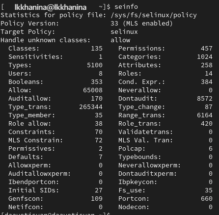

---
## Front matter
lang: ru-RU
title: Презентация лабораторной работы №6
author:
  - Ханина Людмила Константиновна

## i18n babel
babel-lang: russian
babel-otherlangs: english

## Formatting pdf
toc: false
toc-title: Содержание
slide_level: 2
aspectratio: 169
section-titles: true
theme: metropolis
header-includes:
 - \metroset{progressbar=frametitle,sectionpage=progressbar,numbering=fraction}
---

# Презентация к лабораторной работе №6

# Выполнение лабораторной работы

## Входим в систему под своей учетной записью и убеждаемся, что SELinux работает в режиме enforcing политики targeted:
{ #fig:001 }

## Обращаемся с помощью браузера к веб-серверу и убеждаемся, что последний работает:
{ #fig:002 }

## Определяем контекст безопасности веб-сервера Apache:
{ #fig:003 }

## Посмотрим текущее состояние переключателей SELinux для Apache, многие из переключателей находятся в положении “off”:
{ #fig:004 }

## Посмотрим статистику по политике. Множество пользователей - 8, ролей - 14, типов 5100:
{ #fig:005 }

## Посмотрим файлы и поддиректории, находящиеся в директории /var/www. Определим, что в данной директории файлов нет. Только владелец или суперпользователь может создавать файлы в директории /var/www/html:
{ #fig:006 }

## От имени суперпользователя создаём html-файл /var/www/html/test.html. Контекст созданного файла - httpd_sys_content_t:
{ #fig:007 }

## Обращаемся к файлу через веб-сервер, введя в браузере адрес “http://127.0.0.1/test.html”. Файл был успешно отображен:
{ #fig:008 }

## Изучив справку man httpd_selinux, выясняем, что для httpd определены следующие контексты файлов: httpd_sys_content_t, httpd_sys_script_exec_t, httpd_sys_script_ro_t, httpd_sys_script_rw_t, httpd_sys_script_ra_t, httpd_unconfined_script_exec_t. Контекст моего файла - httpd_sys_content_t (в таком случае содержимое должно быть доступно для всех скриптов httpd и для самого демона). Изменяем контекст файла на samba_share_t и проверяем, что контекст поменялся:
{ #fig:009 }

## Попробуем еще раз получить доступ к файлу через веб-сервер, введя в браузере адрес “http://127.0.0.1/test.html”, и получаем сообщение об ошибке (т.к. к установленному ранее контексту процесс httpd не имеет доступа):
{ #fig:010 }

## Командой ```ls -l /var/www/html/test.html``` убеждаемся, что читать данный файл может любой пользователь. Просматриваем системный лог-файл веб-сервера Apache:
{ #fig:011 }

## В файле /etc/httpd/conf/httpd.conf заменяем строчку “Listen 80” на “Listen 81”, чтобы установить веб-сервер Apache на прослушивание TCP-порта 81:
{ #fig:012 }

## Перезапускаем веб-сервер Apache и анализируем лог-файлы командой:
{ #fig:013 }

## Просматриваем файлы “var/log/http/error_log”, “/var/log/http/access_log” и “/var/log/audit/audit.log” и выясняем, что запись появилась в последнем файле:
{ #fig:014 }

## Убеждаемся, что порт TCP-81 установлен. Проверяем список портов, убеждаемся, что порт 81 есть в списке и запускаем веб-сервер Apache снова:
{ #fig:015 }

## Вернём контекст “httpd_sys_cоntent_t” файлу “/var/www/html/test.html” и после этого пробуем получить доступ к файлу через веб-сервер, введя адрес “http://127.0.0.1:81/test.html”, в результате чего увидим содежимое файла - слово “test”:
{ #fig:016 }
{ #fig:017 }

## Исправим обратно конфигурационный файл apache, вернув “Listen 80”. Попытаемся удалить привязку http_port к 81 порту, но этот порт определен на уровне политики, поэтому его нельзя удалить:
{ #fig:018 }

## Удаляем файл “/var/www/html/test.html”:
{ #fig:019 }

# Выводы
В ходе выполнения данной лабораторной работы я развила навыки администрирования ОС Linux, получила первое практическое знакомство с технологией SELinux и проверила работу SELinux на практике совместно с веб-сервером Apache.

